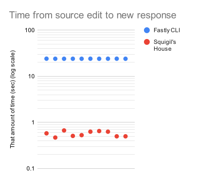

# Update speed

Here are timings from 10 consecutive updates to a simple JavaScript compute
program/entrance script, from the time of the source edit to the time the new
response becomes available.



<!--
unrounded values
fastly cli
24.12
24.03
24.02
24.05
24.05
24.10
24.03
24.09
24.10
24.04
squigil
0.58
0.47
0.67
0.51
0.53
0.63
0.65
0.63
0.50
0.50
-->

| Fastly CLI | Squigil's House |
|-----------:|----------------:|
|         24 |            0.58 |
|         24 |            0.47 |
|         24 |            0.67 |
|         24 |            0.51 |
|         24 |            0.53 |
|         24 |            0.63 |
|         24 |            0.65 |
|         24 |            0.63 |
|         24 |            0.50 |
|         24 |            0.50 |

Tested on a certain computer that is approximately won't-make-it-to-Windows-11
years old on an I-don't-have-any-complaints quality of Internet connection.
The Fastly CLI is invoked with `fastly compute serve --watch`.
Fastly CLI results are measured in seconds to avoid distracting the CPU with
too much polling while it builds the compute package.

Test code available: [update-speed-code](update-speed-code).
Run:

```sh
# from update-speed-code directory

cd fastly-cli
./time.sh 2>&1 | tee ../fastly-cli-output.txt
cd ..
awk '$1 == "real" { print $2; }' fastly-cli-output.txt

cd squigil
SQUIGIL_DOMAIN='<SUBDOMAIN>.edgecompute.app' \
SQUIGIL_ADMIN_SECRET='<ADMIN_SECRET>' \
./time.sh 2>&1 | tee ../squigil-output.txt
cd ..
awk '$1 == "real" { print $2; }' squigil-output.txt
```
